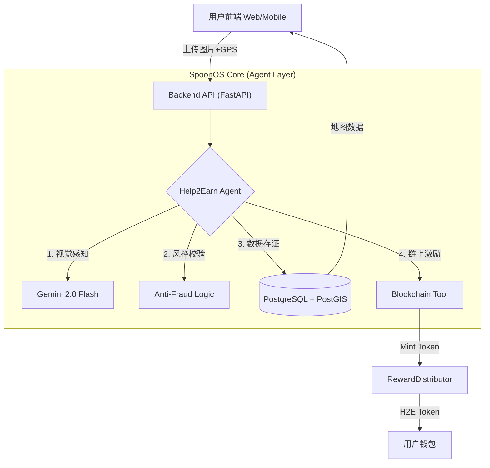

# Help2Earn

基于 SpoonOS 的 DePIN（去中心化物理基建）网络。利用 **Google Gemini 2.0 Flash** 多模态能力作为验证节点，激励全球用户通过「拍照赚钱」模式，构建世界上最精准的无障碍数据层。

## Live Demo

| 服务 | 地址 |
|------|------|
| **Frontend** | https://help2earn-tau.vercel.app/ |
| **Backend API** | https://help2earn-api.onrender.com |

## Smart Contracts (Sepolia Testnet)

| 合约 | 地址 |
|------|------|
| Help2EarnToken | [`0x491c88aBE3FE07dFD13e379dE44D427bA94CE4C9`](https://sepolia.etherscan.io/address/0x491c88aBE3FE07dFD13e379dE44D427bA94CE4C9) |
| RewardDistributor | [`0xDf929aD0C7f32B9E3cce6B86dEaD2ff1522EF0A4`](https://sepolia.etherscan.io/address/0xDf929aD0C7f32B9E3cce6B86dEaD2ff1522EF0A4) |

## 演示视频

> 由于 GitHub README 不支持直接播放仓库内视频，请点击下方链接下载或观看：

### 🎥 [点击观看 Help2Earn 演示视频 (MP4)](assets/videos/Help2Earn480P.mp4)

---

## 核心场景

### 场景 A：数据矿工 (The Miner)

**人物**：Kenji，深圳南山的大学生

**动作**：Kenji 在去学校的路上，发现一家新开的咖啡馆门口有完美的轮椅坡道。他拿出手机，打开 Help2Earn，拍了一张门口的照片并上传。

**结果**：3 秒后，SpoonOS Agent 验证通过，Kenji 的钱包收到了 50 个 tokens 代币（够喝个奶茶）。

**价值**：零工经济，人人都能参与。

### 场景 B：数据消费者 (The User)

**人物**：Sato 先生，轮椅使用者

**动作**：Sato 想去这家咖啡馆，但在 Google Maps 上只看到模糊的标签。他打开 Help2Earn。

**结果**：他不仅看到了「有坡道」的标记，还看到了 AI 对坡道的详细分析：「坡度小于 5 度，路面平整，但注意：自动门开启时间较短。」

**价值**：真正的出行安全感。

---

## 技术架构

本项目采用分层架构，核心是基于 **SpoonOS** 的智能体编排层。



---

## SpoonOS Agent 工作流 (ReAct Loop)

我们基于 SpoonOS SDK 构建了一个定制的 ReAct Agent，它能够自主编排复杂的验证流程：

1.  **👀 视觉感知 (Vision Skill)**
    *   调用 `vision_analyze` 工具，使用 **Gemini 2.0 Flash** 识别图片内容。
    *   判断是否为无障碍设施（电梯、坡道、无障碍厕所等）。
    *   生成详细的中文描述（如：坡度、扶手情况、地面材质）。

2.  **🛡️ 逻辑风控 (Anti-Fraud Skill)**
    *   调用 `anti_fraud_check` 工具。
    *   基于 PostGIS 进行地理围栏检测，防止同一地点的重复提交（50米半径，15天冷却期）。

3.  **💾 数据存证 (Database Skill)**
    *   调用 `database_save_facility` 工具。
    *   将结构化的设施数据和 AI 分析结果存入数据库。

4.  **⛓️ 区块链激励 (Blockchain Skill)**
    *   调用 `blockchain_reward` 工具。
    *   生成唯一的 Location Hash。
    *   自动调用链上合约发放 H2E 代币奖励。

---

## UI 图标与功能

地图界面使用以下图标标识无障碍设施：

| 图标 | 设施类型 | 描述 |
|:---:|:---|:---|
|  | **Ramp (坡道)** | 轮椅坡道，包含坡度分析 |
|  | **Elevator (电梯)** | 垂直电梯，包含按钮高度分析 |
|  | **Toilet (厕所)** | 无障碍卫生间，包含扶手分析 |
|  | **Wheelchair (通用)** | 其他无障碍设施 |

**操作流程：**
1.  **查看**：地图上显示附近的设施图标，点击可查看 AI 生成的详细报告。
2.  **上传**：点击底部相册按钮，拍摄或上传照片。
3.  **验证**：等待 3-5 秒，观察 Agent 的思考过程（Thinking Process）。
4.  **获利**：验证成功后，Token 实时到账。

---

## Tech Stack

| 层级 | 技术 |
|------|------|
| **Frontend** | Next.js 14, TypeScript, Tailwind CSS, RainbowKit, Leaflet |
| **Backend** | FastAPI, **SpoonOS SDK**, Python 3.12 |
| **AI Agent** | **SpoonOS ReAct Agent**, Google Gemini 2.0 Flash |
| **Database** | Supabase (PostgreSQL + PostGIS) |
| **Storage** | Google Cloud Storage |
| **Blockchain** | Solidity, Sepolia Testnet, Alchemy RPC |

---

## 本地开发

### Backend

```bash
cd backend
python -m venv venv
source venv/bin/activate  # Windows: venv\Scripts\activate
pip install -r requirements.txt

# 配置环境变量
cp .env.example .env
# 填入 GEMINI_API_KEY, SUPABASE_URL, PRIVATE_KEY 等

# 启动服务
uvicorn main:app --reload --port 8000
```

### Frontend

```bash
cd frontend
npm install

# 配置环境变量
echo "NEXT_PUBLIC_API_URL=http://localhost:8000" > .env.local
echo "NEXT_PUBLIC_WALLETCONNECT_PROJECT_ID=your_id" >> .env.local

# 启动开发服务器
npm run dev
```

---

## License

MIT
